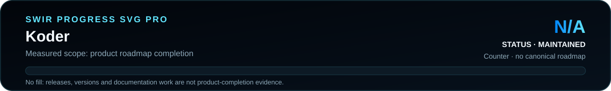

<!-- SWIR-README-STANDARD:v2 -->

<div align="center">


<br>


[](https://github.com/Swir)

[**Highlights**](#-highlights) · [**Quick Start**](#%EF%B8%8F-quick-start) · [**Progress**](#%EF%B8%8F-roadmap--progress) · [**Security Note**](#%EF%B8%8F-security--limitations)

</div>

## 📍 Project Status

| Item | Status |
|---|---|
| Current stage | Legacy educational utility |
| Platform | Python desktop; Windows release available |
| Latest public release | [v1.0.0](https://github.com/Swir/Koder/releases/tag/v1.0.0) |
| Transformation | Repeating-key XOR; reversible, **not modern encryption** |
| Product progress | **N/A** — no canonical measurable roadmap exists |

<p align="center">
  
</p>

Product progress is **N/A** because the repository has no authoritative measurable roadmap. The release version is not used as a completion metric.

## 🚀 Overview

**Koder** is a small PyQt5 desktop utility that applies a repeating XOR transformation to local files. Encoding appends the custom `.swirtv` suffix and decoding applies the same XOR operation with the same four-character key.

This is an educational/reversible file-transformation tool. It is **not a secure file-encryption product** and should not be used to protect secrets or sensitive documents.


## ✨ Highlights

| Feature | What it does |
|---|---|
| 📂 Local file selection | Opens arbitrary text or binary files from the desktop |
| ↔️ Reversible XOR transform | Uses the same operation/key to encode and decode bytes |
| 🔑 Four-character key | Requires exactly four characters before starting a transform |
| 📦 `.swirtv` output | Encoding writes a derived file with the `.swirtv` suffix |
| 🧵 QThread worker | Runs file transformation outside the GUI event handler |
| 🪟 Windows release | v1.0.0 provides an EXE, portable ZIP and ZIP checksum file |

## ⚙️ Quick Start

### Recommended: Windows release

The verified **v1.0.0** release contains `Koder.exe`, `Koder-v1.0.0-Windows-x64.zip` and a `.sha256` checksum file for the ZIP:

[**Download Koder v1.0.0 →**](https://github.com/Swir/Koder/releases/tag/v1.0.0)

### From source

The current application source imports only Python's standard library plus **PyQt5** for its runtime path:

```bash
git clone https://github.com/Swir/Koder.git
cd Koder
python -m pip install PyQt5
python koder.py
```

`requirements.txt` is a broad legacy environment list containing many packages unrelated to this small utility. Installing the entire file is not required by the current `koder.py` imports.

## 📋 Requirements / Compatibility

- Python 3.x for source execution.
- PyQt5.
- Local filesystem read/write access for the selected input and derived output file.
- Windows x64 for the published v1.0.0 packaged build produced by the repository workflow.

## 🎮 Usage / Workflow

### Encode

1. Select a local file.
2. Enter a four-character key.
3. Choose **Encode**.
4. The application reads the file as bytes, applies repeating-key XOR and writes `<input>.swirtv`.

### Decode

1. Select the encoded file.
2. Enter the **same** four-character key.
3. Choose **Decode**.
4. The application applies XOR again and writes the decoded bytes to a derived output path.

The current legacy decode code derives its output name by trimming characters from the selected path; verify the destination filename before relying on the result and keep the original file until you confirm the decoded output.

## 🧠 Technology / Architecture

| Layer | Technology / role |
|---|---|
| GUI | PyQt5 `QMainWindow` and widgets |
| Worker | `QThread` |
| Transformation | Repeating-key XOR over file bytes |
| Packaging | PyInstaller one-file Windows build |
| Release | GitHub Actions EXE + ZIP + SHA-256 |

## 🗺️ Roadmap / Progress

<p align="center">
  
</p>

**Product progress: N/A.** No canonical product roadmap/checklist exists in this repository, so the progress graphic intentionally has no fabricated percentage fill.

## 📦 Releases

The latest verified public release is **v1.0.0**. The repository release workflow builds `Koder.exe`, packages it with the README, and publishes a ZIP plus SHA-256 checksum.

[**GitHub Releases →**](https://github.com/Swir/Koder/releases)

## ⚠️ Security / Limitations

- Repeating XOR with a short four-character key is **not cryptographically secure encryption**.
- Do not use Koder to protect passwords, private keys, confidential files or other sensitive data.
- Keep backups: a wrong key produces incorrect output without an authenticity/integrity check.
- The legacy GUI does not provide authenticated encryption, key derivation, tamper detection or secure key storage.
- The progress widget in the current application does not measure byte-level transformation progress.
- The broad legacy `requirements.txt` should not be interpreted as the actual runtime dependency set of `koder.py`.

## 🔎 Search Keywords

`python file encoder` • `pyqt5 file encoder` • `xor encoder decoder` • `python xor gui` • `reversible file transformation` • `swirtv file format` • `desktop file transformer` • `python binary file utility` • `pyqt5 qthread example` • `windows xor utility` • `educational xor encoder` • `local file obfuscation`

<div align="center">

### `TRANSFORM • RESTORE • VERIFY`

⭐ **If this educational utility is useful, consider leaving a star.**

[**← SWIR profile**](https://github.com/Swir) · [**All projects →**](https://github.com/Swir?tab=repositories)

</div>
